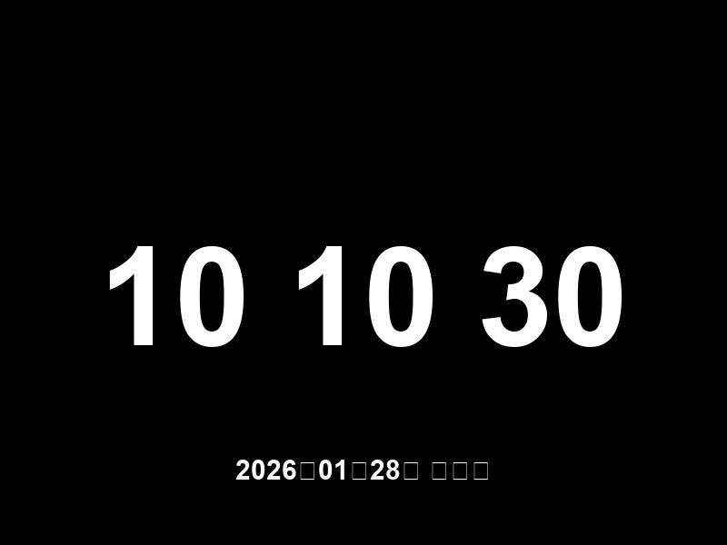

[English](README_en.md) | 中文

# Time Screen - 极简翻页时钟屏幕保护程序

Time Screen 是一款运行在 Windows 上的屏幕保护程序，复刻了经典的 macOS 翻页时钟效果。
它拥有极简的黑色背景、醒目的大字体时间显示以及流畅的翻页动画，让您的屏幕在休息时既美观又实用。

## ✨ 功能特点

- **经典翻页**：还原 macOS 风格的翻页时钟动画，精确到秒。
- **沉浸体验**：自动全屏运行，隐藏任务栏和窗口边框。
- **极简设计**：纯黑背景，无干扰元素，底部显示日期（支持中文）。
- **防误触**：
  - **双击退出**：防止鼠标轻微晃动导致屏保退出，需双击屏幕任意位置退出。
  - **单击无效**：单击屏幕不会退出屏保。
- **字体优化**：针对 Windows 优化的字体渲染，清晰圆润。

## 📦 下载与安装

1.  **下载**：
    - 前往 [Releases](https://github.com/hongguilong/timescreen/releases) 页面下载最新的压缩包。
    - 或者直接下载 `TimeScreen.scr` 文件。

2.  **安装**：
    - 找到下载的 `TimeScreen.scr` 文件。
    - **右键点击**该文件，在弹出的菜单中选择 **"安装" (Install)**。
    - 此时会打开 Windows 的"屏幕保护程序设置"窗口，且已自动选中 "Time Screen"。

3.  **配置**：
    - 在"屏幕保护程序设置"窗口中，设置"等待"时间（例如 5 分钟）。
    - 点击"确定"或"应用"保存设置。

## 🗑️ 卸载说明

1.  打开 Windows 的"屏幕保护程序设置"。
2.  将屏幕保护程序切换为其他（如"无"）。
3.  删除之前下载的 `TimeScreen.scr` 文件及相关依赖文件即可。

## 🛠️ 常见问题

- **Q: 安装后无法启动？**
  - A: 请确保您已将所有依赖文件（如 `.dll` 文件）与 `TimeScreen.scr` 放在同一目录下。建议保留解压后的完整目录结构。

- **Q: 如何退出屏保？**
  - A: 请**双击**屏幕任意位置。移动鼠标或单击不会退出（防误触设计）。

---

_(For Developers: This project is built with Flutter. Source code is available in this repository. Use `flutter run -d windows` to develop.)_
